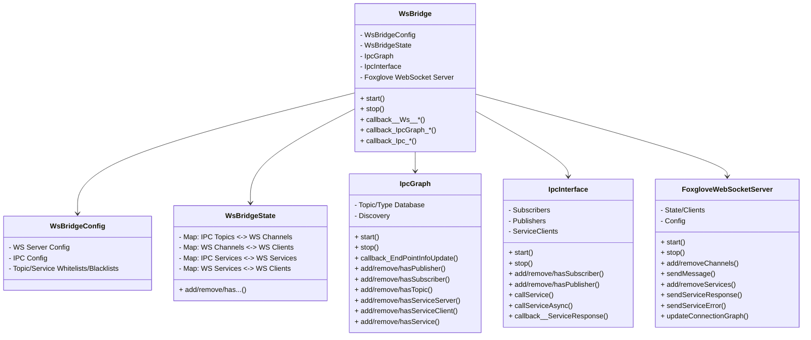

# Module - WebSocket Bridge

## Overview

This module offers a websocket interface to hephaestus, enabling foxglove studio or a similar websocket-capable client to connect to hephaestus communication and:
  - Publish and subscribe to hephaestus topics
  - Trigger hephaestus service calls
  - Monitor the hephaestus node graph (Foxglove has a built in node graph visualizer)

## Build

To build the WebSocket bridge, execute the following command:

```bash
bazel build //modules/websocket_bridge:app
```

## Running the WebSocket Bridge

To run the WebSocket bridge, execute the following command:

```bash
bazel run //modules/websocket_bridge::app -- -c <path to config file>
```

## Bridge Structure



## Test Clients

### Test Client - Services

This client tests the websocket bridge by checking the advertised services and then calling the first one many times while tracking the response times.

```bash
bazel run //modules/websocket_bridge:test_client__services ws://localhost:8765
```

### Test Client - Topics
This client tests the websocket bridge by subscribing to all topics and then advertising mirror topics and pinging back the received messages to the bridge.

```bash
bazel run //modules/websocket_bridge:test_client__topics ws://localhost:8765
```
